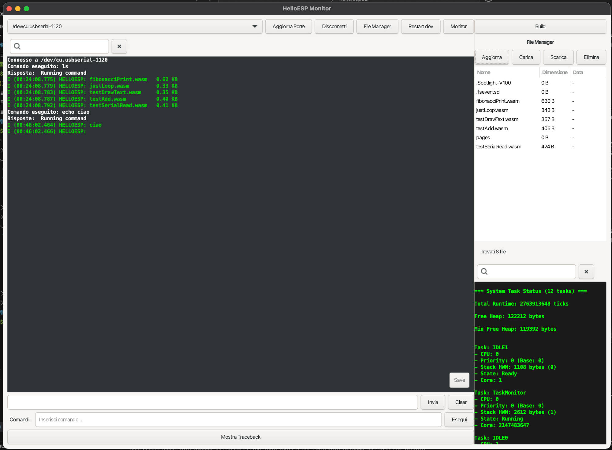

# HELLO ESP32!
HelloESP is a sub(operating system) built on the basis of UNIX-like POSIX libraries of ESP-IDF environment that aims to provide a shell for ESP32 systems with SD card support. 

Well, let's go in order.

Some time ago I bought this thing:


It's an ESP32 with a TFT with resistive touch and SD card support. And it's an ESP32, so bluetooth, Wi-Fi etc. Anyway this lacks of PSRAM support. But patience, I always had a dream about to create a sort of OS for Arduino with touch and SD card support, using every component to achieve the maximum functionality possible. The problem is that if you pay poor, you get poor quality. And I never managed to get SD to work on that shield. 

I had to accept reality, but after years of psychotherapy I found this other cheap component that really has a lot to offer: 2 cores, 240 mhz and circa 340 kb of RAM, so much more respect than an Arduino classic.

But even in this case I'm talking about a cheap component, and the examples about its development that I found was only in chinese, and that was my first time with the ESP-IDF environment.

So I stolen the project structure from very honest GitHub repos named like "ESP32-Cheap-Yellow-Display". Because it doesn't need a name, it's just that cheap yellow thing used only by middle school students and me. 

Anyway, seen that I see the opportunities in every part of my poverty, I interpreted the lack of PSRAM as an opportunity to make things as more optimized as possible.

Anyway, in the above mentioned repository are present examples about usages of [basics and the use various programming languages](https://github.com/witnessmenow/ESP32-Cheap-Yellow-Display/tree/main/Examples): Rust, MicroPython, LVGL and blah blah blah. But my idea was different.

## Hello WASM3!
I wanted to make every kind of programming language portable on the HelloESP, even if are anyway necessary the implementation of the native POSIX-like functions. 

But let's take it one step at a time.

***First of all, a note about the WASM3 developer***: he suffered of the strike of air bomb over his house during the russian invasion, and this makes the repository [wasm3](https://github.com/wasm3/wasm3) 

My fork, [wasm3-helloesp](https://github.com/cekkr/wasm3-helloesp), it's very off-road respect the main repo at the moment. For example, while messing with circular references, during a desperation moment I've substitute some `#ifndef WASM_FILE_H` with `#pragma once` randomly.
There are a lot of python scripts in the folder analyze/ that aims only to build the best circular reference order for the project. The last script I tried finally worked, only I don't remember what of those ones. But I let them there for reference due to the fact that, sometimes, it's still useful have a C project parser using libclang.

### M3Memory is the new black
Anyway, this is an useful training for the creation of a "menuconfig.py" script to allow HelloESP to work on every ESP32 components configuration possible, as long as there is SD reader support. The reason, beyond the fact that it's necessary to store data and binaries, is that the SD card would work as memory paging system. And WASM binaries are perfect for that: the possibility to trace every memory operation let me to create a segmented memory with the support, HelloESP side, of paging of these segments on the SD card. On my device, currently I'm working at 20 MHz of ticks/s with the SD card reader, that allows me to 2 MB/s of writing and reading process for the less used and now needed segments. Due to this particular extension, I've create ad hoc files [`m3_segmented_memory.c`](https://github.com/cekkr/wasm3-helloesp/blob/main/source/m3_segmented_memory.h), in addition to `m3_pointers.c`. Was needed a particular study and reimplementation of various functions and macros around WASM3 source codes. I don't know how much some of that was unnecessary, seen that if I had looked at `m3_api_tracer.c` I would have found out that some achievement may were simpler than than it seemed.

But it doesn't care: a deep study of WASM3 source code was essential, even if it took something like 3 weeks of coding without being able to perform it, I finally found a certain equilibrium in the development line of the project.

Essentialy, if WASM3 when calls `RunCode` use as arguments the macro:

```c
# define d_m3BaseOpSig                  pc_t _pc, m3stack_t _sp, M3MemoryHeader * _mem, m3reg_t _r0
```

WASM3-HelloESP has as base arguments:

```c
# define d_m3BaseOpSig                  pc_t _pc, m3stack_t _sp, M3Memory * _mem, m3reg_t _r0
```

`M3MemoryHeader` is **deprecated** and M3Memory is used instead directly. Several macros are used to combine various combinations of memory allocation. This could be seen directly in function `m3_NewRuntime` in `m3_env.c`:

```c
#if M3Runtime_Stack_Segmented
    runtime->originStack = m3_Malloc (memory, i_stackSizeInBytes + 4 * sizeof (m3slot_t)); 
#else
	runtime->originStack = m3_Def_Malloc (stackSize); // default malloc
#endif 
```

Where `m3_Malloc` works on M3Memory segmentation, instead `m3_Def_Malloc` is the default malloc function, even if reimplemented as `default_malloc` in `m3_core.c` to have a better handling of heap memory management on ESP32.

Anyway, all these experimentations, implementation and modifications mades WASM3-HelloESP currently not mergeable with original WASM3 repo. Anyway, this would be achieve in a second moment with the stabilization of the subsystem.

## HelloESP.Terminal


[HelloESP.Terminal](https://github.com/cekkr/helloesp.terminal) is a python GTK GUI program that I use to develop and test the various system features.

Work in progress...